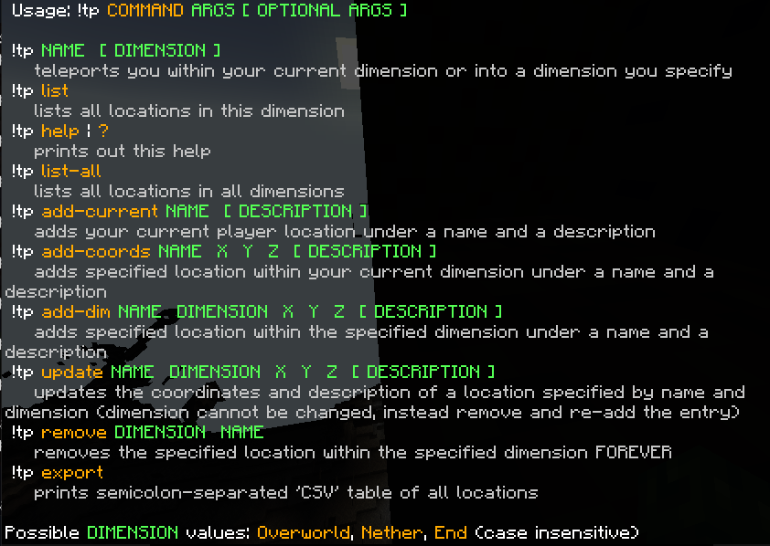

# Simple Minecraft Bedrock named teleport

**Experimental Beta API required**

This is an ad-hoc implementation of a simple teleport command. The script 
plugin is based on the [minecraft-scripting-samples/starter](https://github.com/microsoft/minecraft-scripting-samples/tree/main/ts-starter) template.

The build step `npm run build` is modified. You can try out this plugin on your
own using `npm run local-deploy` and enabling the plugin in your world settings.

## Commands

The output of the `!tp help` or `!tp ?` command:

## Limitations

There is no filesystem access for the plugin, location updates are therefore possible only
by using a `dynamicProperty` (a `key` and `value` pair). The properites utilized by this script
are tied to the `world` entity. **This plugin therefore provides GLOBAL waypoint system!**.

It could be possible to rewrite tiny parts of the script to tie the locations to individual 
`player` entities. From my experience with migrating MC:BE worlds, I concluded that tying
data to `player` entities *could* be unstable (cannot be bothered to confirm).

## Installation

*chuckles*

To enable Experimental API in your server world you **have to copy it over a machine which can run the Bedrock client and enable the APIs over there. After that you have to copy this modified world back...** (Thanks, Microsoft! Q_Q) 

For more: 
https://learn.microsoft.com/en-us/minecraft/creator/documents/scriptingservers?view=minecraft-bedrock-stable#building-out-your-server-world

As this is purely ad-hoc solution for my personal needs (yes, I did not bother with the internal project renaming, UUIDs, ...), 
I just drop the contents of the `dist` folder into `serverRoot/development_behavior_packs/starter`.

**The Experimental API used by the plugin may break anytime!**

## Modification

As you will be pasting source code into the server folders, you can also modify 
them inplace for some minor tweaks (such as enabling `DEBUG` mode, chaing the command head from `!tp` to something else, etc.)

### Debug mode

**This script does not handle server privileges or permissions, enabling debug mode exposes debug commands to everyone. This scipt is not intended to be used on servers with untrusted clients.**

Debug mode must be explicitly enabled on the source level in the `scripts\bmtp-mc-lib.ts` file, `DEBUG` variable. It exposes some (surprisingly) *debug* functionality (via commands).

Command interpretation **with debug mode** works thus:
* First, command is interpreted as a **debug** command - if it is a valid debug command, it performs a debug action, if not, nothing happens 
* Next, the very same command is interpreted as a regular comman (if it overlaps with a valid command). 

(this is because I wanted to make a quick debug mode invisible via the `help` command, 
the behaviour can be changed extremely easily)

Dynamic property **keys** "reserved" (used) by the plugin: 
* `__BMTP*`, where `*` is any string *(not actually but again, cannot care less about specifying every bit as this limitation is IMO good enough)*

#### Debug commands

* `!tp dbg-exit` - disables debug mode, no going back!
* `!tp dbg-inspect` - prints out all dynamic properties recognised/parsed by the script (all the script's storage)
* `!tp dbg-clear-IKNOWWHATIMDOING` - clears all the script's storage (dynamic properties used by the script - EXTREMELY DESCRUCTIVE OPERATION!)

## Testing

`npx tsx .\test\test-main.ts`

*who could have expected 700+ tests for a simple parser?*
